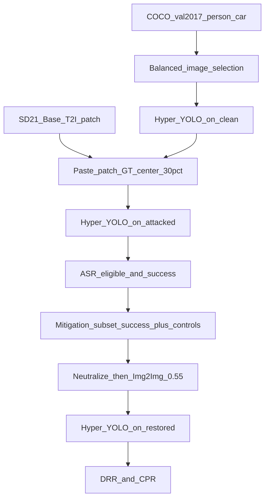
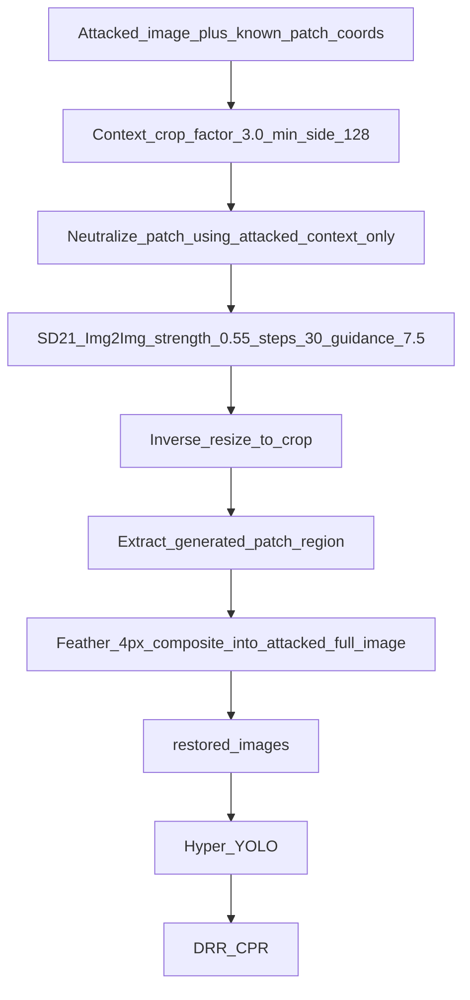
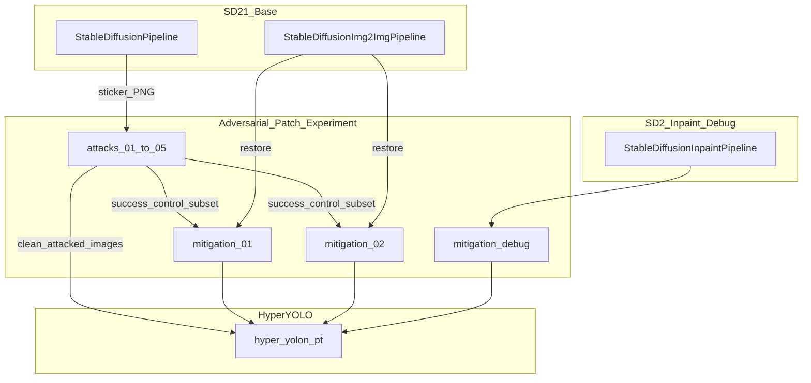

# Adversarial Patch Experiment — Complete Technical Reference

This document is the master reference for the entire **`D:\project CS\`** workspace: the experiment code/results **and** the three model trees it depends on. It explains every major component: models, patch generation, attack pipelines, mitigation pipelines, metrics, final results, debug experiments, scripts, and freeze/safety rules.

**Document location (workspace root):** `D:\project CS\alldetails.md`

**Workspace root:** `D:\project CS\`

**Experiment root:** `D:\project CS\Adversarial-Patch-Experiment`

**Three sibling projects / model trees:**

| Tree | Path | Role |
|------|------|------|
| Victim detector | `D:\project CS\Hyper-YOLO` | Hyper-YOLO object detection (`hyper-yolon.pt`) |
| Diffusion (patch + final Img2Img) | `D:\project CS\Stable-Diffusion-Patch` | SD 2.1 Base for patch T2I and mitigation Img2Img |
| Experiment + debug inpaint weights | `D:\project CS\Adversarial-Patch-Experiment` | Attacks, mitigations, scripts; also hosts SD2 inpainting under `mitigation_models\` (debug only) |

Deep per-model documentation is in [§13–§16](#13-workspace-layout-dproject-cs). Hyper-YOLO and Stable-Diffusion-Patch remain **READ-ONLY** during the mitigation phase.

---

## Table of contents

1. [Project overview](#1-project-overview)
2. [Models — names, paths, and roles](#2-models--names-paths-and-roles)
3. [How the adversarial patch model works](#3-how-the-adversarial-patch-model-works)
4. [Attack pipeline (end-to-end)](#4-attack-pipeline-end-to-end)
5. [Mitigation pipeline (end-to-end)](#5-mitigation-pipeline-end-to-end)
6. [Final mitigation results](#6-final-mitigation-results)
7. [Debug / research path (not final defense)](#7-debug--research-path-not-final-defense)
8. [Scripts index](#8-scripts-index)
9. [Safety and freeze rules](#9-safety-and-freeze-rules)
10. [How to reproduce](#10-how-to-reproduce)
11. [Folder map](#11-folder-map)
12. [Glossary](#12-glossary)
13. [Workspace layout (`D:\project CS\`)](#13-workspace-layout-dproject-cs)
14. [Model 1 — Hyper-YOLO (victim detector)](#14-model-1--hyper-yolo-victim-detector)
15. [Model 2 — Stable Diffusion 2.1 Base](#15-model-2--stable-diffusion-21-base-patch-t2i--final-img2img)
16. [Model 3 — Stable Diffusion 2 Inpainting (debug only)](#16-model-3--stable-diffusion-2-inpainting-debug-only)
17. [How the three models connect](#17-how-the-three-models-connect)
18. [Extra workspace / experiment facts](#18-extra-workspace--experiment-facts)
19. [Complete data appendix (all result types)](#19-complete-data-appendix-all-result-types)

---

## 1. Project overview

### 1.1 Goal

Evaluate whether **diffusion-generated square sticker patches**, placed on COCO **person** and **car** targets, can suppress Hyper-YOLO detections (Attack Success Rate), and whether a **known-location** Stable Diffusion **Img2Img** restoration baseline can recover detections after attack (Detection Recovery Rate) without destroying detections that the attack did not suppress (Control Preservation Rate).

### 1.2 High-level system architecture



### 1.3 What this project is / is not

| Is | Is not |
|----|--------|
| Physical-style **sticker** patch evaluation (opaque paste) | Gradient-optimized universal adversarial patch training |
| Frozen Hyper-YOLO as the **victim** | Retraining or fine-tuning Hyper-YOLO |
| Known-location restoration (patch coordinates known) | Blind patch detection / localization as the defense |
| Final defenses = **SD 2.1 Base Img2Img** + neutralization | Final defenses = dedicated SD2 inpainting (those are debug-only) |

### 1.4 Completed experiment series

| Phase | IDs | Status |
|-------|-----|--------|
| Attacks | `attack_01` … `attack_05` | COMPLETE — permanently READ-ONLY |
| Final mitigations | `mitigation_01` (from `attack_02`), `mitigation_02` (from `attack_05`) | COMPLETE — READ-ONLY for reporting |
| Debug / pilots | under `mitigation_debug/` | Research only — not final defense statistics |

---

## 2. Models — names, paths, and roles

### 2.1 Model inventory

| Model | Hub / identity | Local path | Diffusers / runtime class | Used for |
|-------|----------------|------------|---------------------------|----------|
| **Hyper-YOLO** | Project weights `hyper-yolon.pt` | `D:\project CS\Hyper-YOLO\weights\hyper-yolon.pt` | Ultralytics `model.predict` | Victim detector for clean, attacked, and restored images |
| **Stable Diffusion 2.1 Base** | `stabilityai/stable-diffusion-2-1-base` | `D:\project CS\Stable-Diffusion-Patch\model` | `StableDiffusionPipeline` | Generate 512×512 adversarial sticker candidates |
| **Same SD 2.1 Base weights** | same | same | `StableDiffusionImg2ImgPipeline` | **Final** mitigation_01 / mitigation_02 restoration |
| **Stable Diffusion 2 Inpainting** | `sd2-community/stable-diffusion-2-inpainting` (downloaded locally) | `D:\project CS\Adversarial-Patch-Experiment\mitigation_models\stable-diffusion-2-inpainting` | `StableDiffusionInpaintPipeline` | **Debug / research only** — never used for final mitigation_01/02 |

### 2.2 Python environments

| Purpose | Interpreter |
|---------|-------------|
| Hyper-YOLO + experiment orchestration | `D:\project CS\Hyper-YOLO\.venv\Scripts\python.exe` |
| Stable Diffusion workers (patch gen + Img2Img restore) | `D:\project CS\Stable-Diffusion-Patch\.venv\Scripts\python.exe` |

Orchestration scripts live under the experiment `scripts/` folder but call the SD worker via subprocess into the Stable-Diffusion-Patch venv so Diffusers loads correctly.

### 2.3 Frozen Hyper-YOLO settings

These settings are identical for attacks and mitigations (source of truth: `scripts/mitigation_config.py` and `scripts/pipeline_core.py`):

| Parameter | Value | Meaning |
|-----------|-------|---------|
| `conf` | **0.25** | Confidence threshold |
| `iou` | **0.7** | NMS IoU threshold (detector internal) |
| `imgsz` | **640** | Inference image size |
| `device` | **cpu** | Evaluation device for YOLO |
| Target-match IoU | **0.50** | Separate from NMS: GT vs predicted box match gate |

### 2.4 Target matching rule (canonical)

A selected COCO ground-truth target is considered **detected** if and only if:

1. There exists at least one prediction with the **same class name** as the selected target (`person` or `car`), and  
2. Among same-class predictions, the **maximum IoU** with the selected GT bbox is **≥ 0.50**.

If multiple same-class boxes exist, the pipeline keeps the **highest-IoU** match for confidence/IoU reporting.

This rule is implemented in `pipeline_core.evaluate_target_match` and reused for:

- clean baseline detections  
- attacked detections / ASR  
- mitigated detections / Detection Recovery Rate / Control Preservation  

**Important:** NMS IoU (0.7) is *not* the same threshold as target-match IoU (0.50).

---

## 3. How the adversarial patch model works

### 3.1 What a “patch” is in this project

Each attack uses one **diffusion-generated square sticker image** (PNG), resized to a per-image pixel size based on the GT box, then **opaquely pasted** onto the attacked photograph. There is no alpha blending, no rotation, and no brightness change in the frozen attack protocol.

### 3.2 Patch generation (text-to-image)

**Script:** `scripts/generate_candidate_patch.py`  
**Config:** `scripts/patch_config.py`  
**Pipeline:** `StableDiffusionPipeline` on local SD 2.1 Base  
**Output size:** 512×512 PNG  

Global copies live in:

`D:\project CS\Adversarial-Patch-Experiment\diffusion_patches\diffusion_patch_XX.png`

Each attack also keeps a copy under `attacks/attack_XX/patch/`.

#### Patch definitions used for completed attacks

| Attack | Filename | Seed | Prompt theme |
|--------|----------|------|----------------|
| attack_01 | `diffusion_patch_01.png` | 101 | Complex geometric patterns |
| attack_02 | `diffusion_patch_02.png` | 102 | Sharp zigzag lines |
| attack_03 | `diffusion_patch_03.png` | 103 | Concentric circles |
| attack_04 | `diffusion_patch_04.png` | 104 | Diagonal stripes |
| attack_05 | `diffusion_patch_05.png` | 105 | Mosaic tiles |

(`patch_config.py` also defines seeds 106–110 for potential future patches; **attack_06 was never created**.)

Generation is invoked automatically by the attack pipeline via `pipeline_core.ensure_candidate_patch` if the PNG is missing, using the Stable-Diffusion-Patch Python environment and `local_files_only` model loading.

### 3.3 Patch geometry (frozen formula)

For every selected image with GT box `(bbox_x, bbox_y, bbox_w, bbox_h)` and image size `(W, H)`:

```text
patch_size = max(1, round(0.30 * min(bbox_w, bbox_h)))

cx = bbox_x + bbox_w / 2
cy = bbox_y + bbox_h / 2

px = clamp(cx - patch_size/2, 0, W - patch_size)
py = clamp(cy - patch_size/2, 0, H - patch_size)

x1 = round(px)
y1 = round(py)
x2 = x1 + patch_size
y2 = y1 + patch_size
```

Constant: **`PATCH_SCALE = 0.30`** (30% of the shorter GT side).

Properties:

- Square patch  
- Centered on the GT box center (then clamped into the image)  
- Rotation = 0°  
- Opacity = 100% (hard overwrite)  

The **same geometry** is reconstructed later for mitigation masks (validated against attack metadata; expected check: **400/400 with 0 mismatches** on attack_05).

### 3.4 Patch application

Implemented in `pipeline_core.apply_patch_to_image`:

1. Load attacked/clean RGB image.  
2. Compute geometry as above.  
3. Resize the diffusion sticker to `patch_size × patch_size` (OpenCV area interpolation).  
4. Overwrite image pixels in `[y1:y2, x1:x2]`.  
5. Save to `attacks/attack_XX/patched_images/<filename>.jpg`.

---

## 4. Attack pipeline (end-to-end)

### 4.1 Primary driver

**Canonical automatic pipeline:** `scripts/run_attack_pipeline.py`  
**Core helpers:** `scripts/pipeline_core.py`  
**Legacy smaller runner (historical):** `scripts/run_attack.py` — fixed small set; prefer the automatic pipeline for ASR definitions.

### 4.2 Stage-by-stage workflow


1. **Resolve attack ID** — next `attack_NN`; image count schedule `200 + (N-1)*50`.  
2. **Select images** — balanced person/car from COCO val2017 via selection helpers.  
3. **Clean Hyper-YOLO** — save predictions/labels; evaluate target match.  
4. **Ensure patch** — generate or reuse `diffusion_patch_NN.png`.  
5. **Paste** — create `patched_images/`.  
6. **Attacked Hyper-YOLO** — same frozen settings.  
7. **Report** — `attack_results.csv`, `attack_summary.txt`, update global comparison.

### 4.3 Image-count schedule (completed)

| Attack | Images | Person | Car | Patch seed | Image `random_seed` |
|--------|--------|--------|-----|------------|---------------------|
| attack_01 | 200 | 100 | 100 | 101 | 771733677 |
| attack_02 | 250 | 125 | 125 | 102 | 799732703 |
| attack_03 | 300 | 150 | 150 | 103 | 1593893481 |
| attack_04 | 350 | 175 | 175 | 104 | 1978585250 |
| attack_05 | 400 | 200 | 200 | 105 | 2069153322 |

(`random_seed` selects the balanced COCO subset for that attack; `patch_seed` selects the diffusion sticker.)

### 4.4 ASR definitions

| Flag / metric | Definition |
|---------------|------------|
| `eligible_for_asr = Yes` | Clean target match succeeded (`clean_detected = Yes`) |
| `attack_success = Yes` | Eligible **and** attacked target match failed (`attacked_detected = No`) |
| **Attack Success Rate (ASR)** | `100 × (number of attack_success) / (number of eligible_for_asr)` |

Per-class ASR uses the same rule within person-only / car-only eligible subsets.

**Do not confuse ASR with Detection Recovery Rate** (a mitigation metric).

### 4.5 Attack results (from `results/all_attacks_comparison.csv`)

| Attack | ASR eligible | Successes | ASR | Person ASR | Car ASR |
|--------|--------------|-----------|-----|------------|---------|
| attack_01 | 169 | 9 | **5.33%** | 4.49% | 6.25% |
| attack_02 | 203 | 15 | **7.39%** | 3.77% | 11.34% |
| attack_03 | 240 | 12 | **5.00%** | 1.57% | 8.85% |
| attack_04 | 287 | 13 | **4.53%** | 2.74% | 6.38% |
| attack_05 | 330 | 20 | **6.06%** | 2.30% | 10.26% |

Highest ASR among completed attacks: **attack_02 (7.39%)**.

Comparison artifacts:

- `D:\project CS\Adversarial-Patch-Experiment\results\all_attacks_comparison.csv`  
- `D:\project CS\Adversarial-Patch-Experiment\results\all_attacks_comparison.png`  

These files are **frozen** — never modify after the attack phase.

### 4.6 Per-attack folder layout

```text
attacks/attack_XX/
├── clean_images/
├── patched_images/
├── patch/                    # diffusion_patch_XX.png copy
└── results/
    ├── attack_results.csv
    ├── selected_images.csv
    ├── attack_summary.txt
    ├── clean_predictions/
    ├── attacked_predictions/
    └── comparison/
```

### 4.7 Why attacks are frozen

After the attack phase completed, `attack_01`–`attack_05` are **permanently READ-ONLY**. Mitigation experiments **copy** needed images/metadata into `mitigations/mitigation_XX/` and never rewrite attack CSVs, patches, or patched images. **attack_06 must not be created.**

---

## 5. Mitigation pipeline (end-to-end)

### 5.1 Method name (official)

**Simplified known-location diffusion-based restoration baseline**

This is the **only** method used for final `mitigation_01` and `mitigation_02`.

### 5.2 Orchestrator and worker

| Component | Path |
|-----------|------|
| Orchestrator | `scripts/run_mitigation_pipeline.py` |
| Config | `scripts/mitigation_config.py` |
| Subset selection | `scripts/select_mitigation_subset.py` |
| SD Img2Img worker | `scripts/restore_patch_region.py` |
| Metrics / plots | `scripts/mitigation_reporting.py` |

### 5.3 Restoration data flow



### 5.4 Critical input rule

**INPUT for restoration = attacked image + known patch location only.**

Clean image pixels are used for **evaluation / verification panels only**. They must **never** be used for:

- neutralization  
- filling / initialization  
- SD Img2Img input  
- compositing into the restored result  

Config flag: `clean_pixels_used_for_restoration: false`.

### 5.5 Context crop

Given patch box `(x1,y1,x2,y2)`:

```text
side = max(MINIMUM_CONTEXT_SIDE, round(CONTEXT_CROP_FACTOR * max(patch_w, patch_h)))
side = min(side, image_w, image_h)
crop = square centered on patch, clamped into the image
```

Frozen values: `CONTEXT_CROP_FACTOR = 3.0`, `MINIMUM_CONTEXT_SIDE = 128`.

### 5.6 Patch neutralization (ON — mandatory for finals)

When `--neutralize` is set (required by frozen config `PATCH_NEUTRALIZATION = True`):

1. Work inside the context crop of the **attacked** image.  
2. Gaussian-blur the crop (radius 18).  
3. Estimate a **ring mean color** around the patch from attacked pixels (`pad = max(4, patch_side // 6)`).  
4. Replace the patch region with a blend: `0.65 * blurred + 0.35 * mean_color`, feathered into the crop.  
5. Resize the neutralized crop to 512×512 and save under `neutralized_inputs/` for inspection.  
6. Feed that 512×512 image into Img2Img.

Purpose: remove the high-contrast sticker pattern so Img2Img is not forced to “preserve” adversarial texture.

### 5.7 Stable Diffusion Img2Img step

| Parameter | Frozen value |
|-----------|--------------|
| Pipeline | `StableDiffusionImg2ImgPipeline` |
| Weights | `D:\project CS\Stable-Diffusion-Patch\model` (SD 2.1 Base) |
| `local_files_only` | True |
| Resolution | 512×512 |
| `strength` | **0.55** |
| `num_inference_steps` | 30 |
| `guidance_scale` | 7.5 |
| Restoration seed | **20260727** (deterministic) |
| Positive prompt | `realistic natural photograph, restore the original object surface, natural texture, consistent lighting, no sticker or artificial patch` |
| Negative prompt | `sticker, adversarial patch, logo, text, watermark, abstract pattern, cartoon, distortion` |

Actual SD compute device in completed runs: **CUDA** (with memory-safe settings as needed). YOLO evaluation remains on **CPU**.

### 5.8 Inverse mapping and feathered composite

1. Resize Img2Img output back to the original crop size.  
2. Extract only the patch subregion from that restored crop.  
3. Composite that region into a **copy of the full-resolution attacked image**.  
4. Apply a **4-pixel feather** (`FEATHER_PIXELS = 4`) so edges blend.  
5. Everything outside the patch region stays identical to the attacked image.

### 5.9 No silent fallback

If Stable Diffusion fails for an image, the pipeline must **not** silently save the attacked or neutralized image as a “successful” restoration. Failures are recorded explicitly.

### 5.10 Subset selection for mitigations

**Success cases** (all included):

- `eligible_for_asr = Yes`  
- `clean_detected = Yes`  
- `attacked_detected = No`  
- `attack_success = Yes`  

**Control cases** (deterministic sample of size `control_count`):

- `eligible_for_asr = Yes`  
- `attack_success = No`  
- `attacked_detected = Yes`  

Controls are selected with a fixed seed (balanced by class via existing logic) — **no manual cherry-picking**.

| Mitigation | Source attack | Successes | Controls | Control seed |
|------------|---------------|-----------|----------|--------------|
| mitigation_01 | attack_02 | 15 (all) | 15 | 22021501 |
| mitigation_02 | attack_05 | 20 (all) | 20 | 22021505 |

### 5.11 Mitigation metrics (definitions)

| Metric | Aggregation set | Definition |
|--------|-----------------|------------|
| **Detection Recovery Rate (DRR)** | SUCCESS subset only | `100 × recovered_target_count / source_attack_success_count` where recovered means mitigated target match = Yes |
| **remaining_failed_targets** | SUCCESS | successes still undetected after mitigation |
| **Control Preservation Rate (CPR)** | CONTROL subset only | `100 × control_preserved_count / control_count` |
| **Control Regression Rate** | CONTROL | `100 × control_regression_count / control_count` |

**Naming rule:** Do **not** call Detection Recovery Rate “ASR after defense.” ASR is an attack-phase metric. DRR is a mitigation-subset recovery metric.

Confidence / IoU means must be labeled by aggregation set:

- **SUCCESS SUBSET** — clean / attacked / mitigated confidence & IoU (+ recovery gaps)  
- **CONTROL SUBSET** — clean / attacked / mitigated confidence & IoU  
- **OVERALL SELECTED SUBSET** — optional mean over all selected images (success + control), explicitly labeled  

### 5.12 Mitigation folder structure

```text
mitigations/mitigation_XX/
├── source_clean_images/          # evaluation copies only
├── source_attacked_images/       # restoration inputs
├── source_attack_data/           # frozen metadata copies
├── masks/                        # exact patch masks
├── neutralized_inputs/           # 512×512 Img2Img inputs
├── restored_images/              # final full-resolution outputs
└── results/
    ├── mitigated_predictions/
    │   ├── images/
    │   └── labels/
    ├── verification/             # 3-panel verify images
    ├── comparison/
    ├── mitigation_results.csv
    ├── mitigation_summary.txt
    ├── mitigation_overview.jpg
    └── restoration_config.json
```

### 5.13 Why final mitigations do NOT use SD2 inpainting

Dedicated `StableDiffusionInpaintPipeline` experiments under `mitigation_debug/` showed sticker removal but **unstable hallucinations**. Final comparable experiments therefore keep the **same Img2Img + neutralization method** as mitigation_01 so mitigation_02 remains methodologically comparable.

---

## 6. Final mitigation results

### 6.1 mitigation_01 (COMPLETE)

| Field | Value |
|-------|-------|
| Path | `mitigations\mitigation_01\` |
| Source attack | **attack_02** |
| Method | Simplified known-location diffusion-based restoration baseline |
| Subset total | **30** (15 success + 15 control) |
| Success class split | person **4**, car **11** |
| Control class split | person **7**, car **8** (as validated) |
| recovered_target_count | **4 / 15** |
| **Detection Recovery Rate** | **26.67%** |
| remaining_failed_targets | 11 |
| control_preserved_count | **13 / 15** |
| **Control Preservation Rate** | **86.67%** |
| control_regression_count | 2 |
| Control Regression Rate | 13.33% |
| Person recovery | **0 / 4 = 0.00%** |
| Car recovery | **4 / 11 = 36.36%** |
| Mean conf recovery (success) | 0.0969 |
| Mean IoU recovery (success) | 0.2067 |
| SD device (actual) | cuda |
| Restorations | 30 / 30 completed, 0 failures |

#### SUCCESS-subset confidence / IoU (mitigation_01)

| | Clean | Attacked | Mitigated | Recovery |
|--|-------|----------|-----------|----------|
| Mean confidence | 0.4142 | 0.0000 | 0.0969 | 0.0969 |
| Mean IoU | 0.8784 | 0.0000 | 0.2067 | 0.2067 |

#### CONTROL-subset confidence / IoU (mitigation_01)

| | Clean | Attacked | Mitigated |
|--|-------|----------|-----------|
| Mean confidence | 0.7440 | 0.7342 | 0.6369 |
| Mean IoU | 0.8960 | 0.8922 | 0.7990 |

#### Recovered / regressed IDs (mitigation_01)

- **Recovered (4, all car):** `000000135410.jpg`, `000000193717.jpg`, `000000413689.jpg`, `000000527220.jpg`
- **Regressed controls (2, both car):** `000000134886.jpg`, `000000365207.jpg`
- Clean→mitigated gaps (success): conf **0.3173**, IoU **0.6716**

Also present historically: `mitigations\mitigation_01(archived)\` — older run; **do not reuse as final**.

### 6.2 mitigation_02 (COMPLETE)

| Field | Value |
|-------|-------|
| Path | `mitigations\mitigation_02\` |
| Source attack | **attack_05** |
| Method | **Exact same frozen method as mitigation_01** |
| Subset total | **40** (20 success + 20 control) |
| Success class split | person **4**, car **16** |
| Control class split | person **10**, car **10** |
| Geometry validation | 400 / 400 checked, **0 mismatches** |
| SD restorations | **40 completed / 0 failed** |
| Restored images | 40 |
| YOLO prediction images | 40 |
| YOLO labels | 39 (one restored image had zero detections → no label file) |
| Verification images | 40 |
| recovered_target_count | **4 / 20** |
| **Detection Recovery Rate** | **20.00%** |
| remaining_failed_targets | 16 |
| control_preserved_count | **19 / 20** |
| **Control Preservation Rate** | **95.00%** |
| control_regression_count | 1 (`000000022755.jpg`, car) |
| Control Regression Rate | 5.00% |
| Person recovery | **2 / 4 = 50.00%** |
| Car recovery | **2 / 16 = 12.50%** |
| Mean conf recovery (success) | 0.0925 |
| Mean IoU recovery (success) | 0.1761 |
| SD device (actual) | cuda |

#### SUCCESS-subset confidence / IoU (mitigation_02)

| | Clean | Attacked | Mitigated | Recovery |
|--|-------|----------|-----------|----------|
| Mean confidence | 0.4609 | 0.0000 | 0.0925 | 0.0925 |
| Mean IoU | 0.8351 | 0.0000 | 0.1761 | 0.1761 |

#### CONTROL-subset confidence / IoU (mitigation_02)

| | Clean | Attacked | Mitigated |
|--|-------|----------|-----------|
| Mean confidence | 0.7366 | 0.7257 | 0.7151 |
| Mean IoU | 0.8727 | 0.8614 | 0.7980 |

#### Recovered / regressed IDs (mitigation_02)

- **Recovered (4):** `000000026465.jpg` (person), `000000135410.jpg` (car), `000000448256.jpg` (person), `000000527220.jpg` (car)
- **Regressed control (1):** `000000022755.jpg` (car)
- **Shared recoveries with mitigation_01:** `000000135410.jpg`, `000000527220.jpg`

### 6.3 Side-by-side comparison

Artifacts:

- `results\all_mitigations_comparison.csv`  
- `results\all_mitigations_comparison.png`  

| Mitigation | Source | n | DRR | CPR | Person recovery | Car recovery |
|------------|--------|---|-----|-----|-----------------|--------------|
| mitigation_01 | attack_02 | 30 | **26.67%** | **86.67%** | 0.00% | 36.36% |
| mitigation_02 | attack_05 | 40 | **20.00%** | **95.00%** | 50.00% | 12.50% |

Interpretation notes for a report:

- Both use the **same** Img2Img strength 0.55 + neutralization protocol.  
- Different source attacks and subset sizes → rates are **comparable methodologically**, not identical populations.  
- CPR is high on both (especially mitigation_02), while DRR remains modest → restoration often preserves already-visible targets better than it recovers suppressed ones.  
- Class behavior differs: mitigation_01 recovered only cars; mitigation_02 recovered some persons and fewer cars relatively.

---

## 7. Debug / research path (not final defense)

Everything under `mitigation_debug/` is **experimental**. It must not be reported as final defense statistics for mitigation_01/02.

### 7.1 Debug experiment folders

| Folder | Purpose |
|--------|---------|
| `one_image_restore` | Early single-image Img2Img restore tracing |
| `two_case_final_trace` | Two-case compositing / pixel provenance traces |
| `multi_image_pilot_055` | 6-image pilot: neutralization ON, strength 0.55 (Img2Img) |
| `sd2_inpainting_one_image` | Dedicated SD2 inpaint strengths on one image |
| `sd2_inpainting_pilot_100` | Structured 6-image SD2 inpaint pilot (strength 1.00) |
| `context_aware_inpainting_one_image` | Context/guidance A/B/C on difficult large-patch case `000000407083` |
| `prompt_only_inpainting_test` | Prompt-only variants P1/P2/P3 with geometry locked to Variant B |

### 7.2 Key research findings (summary)

1. **Compositing was not the bug** — restored pixels came from SD output as designed.  
2. **Img2Img quality was unstable** — flat/gray fills vs face / object hallucinations depending on case.  
3. **Dedicated SD2 inpainting** removed stickers more cleanly in places but still hallucinated (landscape-like or unrelated objects).  
4. **Context scaling alone** (factors 5/7 at guidance 4.5) did not solve hallucinations on `000000407083`; factors 5 and 7 clamped to the same full-image crop.  
5. **Prompt tuning alone** (P1/P2/P3 with all else fixed) produced only small pixel changes vs previous Variant B → conclusion recorded as **PROMPT TUNING ALONE IS INSUFFICIENT**.  

#### Pilot numeric snapshots (not final defense stats)

| Pilot | Path | Headline numbers |
|-------|------|------------------|
| Img2Img 0.55 | `mitigation_debug\multi_image_pilot_055\` | Success recovered **2 / 3**; controls preserved **3 / 3**; large-patch `407083` not recovered |
| SD2 inpaint 1.00 | `mitigation_debug\sd2_inpainting_pilot_100\` | DRR **33.33%** (1/3); CPR **100%** (3/3); sticker removed **6/6**; hallucinations **4**; flat/gray **0**; seams **4**; natural **2** |
| Prompt-only | `mitigation_debug\prompt_only_inpainting_test\` | P1/P2/P3 all det=Yes; region MAE vs previous B ≈ **11–15**; still object-like fills → prompt tuning alone insufficient |

Recommended research next step (not executed as a final mitigation): context-aware prefill + low-strength SD refinement.

### 7.3 Separation rule for writing reports

| Report as | Do not report as |
|-----------|------------------|
| Final baseline: mitigation_01 / mitigation_02 Img2Img | Final = SD2 inpainting pilot recovery |
| Debug evidence for failure modes | Full-dataset ASR after defense from 6-image pilots |

---

## 8. Scripts index

All under `D:\project CS\Adversarial-Patch-Experiment\scripts\`:

| Script | Purpose |
|--------|---------|
| `run_attack_pipeline.py` | Full automatic attack pipeline (canonical) |
| `run_attack.py` | Legacy single/small attack runner |
| `pipeline_core.py` | Shared geometry, YOLO, target match, ASR, patch apply/gen glue |
| `generate_candidate_patch.py` | SD 2.1 Base text-to-image patch worker |
| `patch_config.py` | Patch filenames, seeds, prompts (01–10) |
| `select_coco_images.py` | COCO val2017 person/car selection helpers |
| `run_clean_baseline.py` | Clean Hyper-YOLO baseline on selected images |
| `comparison_reporting.py` | Clean-vs-attacked attack comparison reporting |
| `recalculate_attack_evaluation.py` | Recompute attack metrics from saved labels |
| `attack_utils.py` | Dynamic attack folder creation / numbering utilities |
| `setup_attack_folders.py` | Inspect attacks; report next attack number |
| `cleanup_empty_attacks.py` | Remove empty pre-created attack scaffolds |
| `run_mitigation_pipeline.py` | Full mitigation orchestrator (validate + run) |
| `mitigation_config.py` | Frozen mitigation constants and specs |
| `select_mitigation_subset.py` | Deterministic success + control subset + geometry validation |
| `restore_patch_region.py` | Neutralize → crop → Img2Img → feather composite worker |
| `mitigation_reporting.py` | DRR/CPR metrics, CSV, overview, global comparison |
| `debug_mitigation_restore_one.py` | One-image mitigation restore debug |
| `debug_multi_image_pilot_055.py` | 6-image Img2Img pilot (strength 0.55) |
| `debug_two_case_final_trace.py` | Two-case restoration trace |
| `debug_sd2_inpaint_one_image.py` | One-image dedicated SD2 inpaint debug |
| `debug_sd2_inpainting_pilot_100.py` | 6-image SD2 inpaint pilot |
| `debug_context_aware_inpaint_one.py` | Context/guidance A/B/C on `000000407083` |
| `debug_prompt_only_inpaint_one.py` | Prompt-only P1/P2/P3 test |

---

## 9. Safety and freeze rules

### 9.1 Permanently READ-ONLY

- `attacks/attack_01` … `attacks/attack_05` (images, CSVs, patches, scripts outputs)  
- `results/all_attacks_comparison.csv` and `.png`  
- `D:\project CS\Hyper-YOLO\` dependency tree  
- `D:\project CS\Stable-Diffusion-Patch\` dependency tree  
- Final `mitigations/mitigation_01/` (do not rerun/overwrite for reporting integrity)  
- `mitigations/mitigation_01(archived)/`  
- Prior `mitigation_debug/` experiments (do not overwrite when adding new debug folders)

### 9.2 Forbidden

- Creating `attack_06`  
- Rerunning or modifying attack logic/results  
- Using clean pixels for restoration  
- Silently substituting non-SD images as “restored”  
- Calling Detection Recovery Rate “ASR after defense”  
- Treating SD2 inpainting pilots as final mitigation_01/02 replacements without an explicit new experiment ID and methodology change notice  

### 9.3 Allowed comparison updates

After mitigation_02 completed, mitigation-only comparison files may exist/update:

- `results/all_mitigations_comparison.csv`  
- `results/all_mitigations_comparison.png`  

Never touch `all_attacks_comparison.*`.

---

## 10. How to reproduce

Working directory:

```text
cd "D:\project CS\Adversarial-Patch-Experiment"
```

Hyper-YOLO Python:

```text
D:\project CS\Hyper-YOLO\.venv\Scripts\python.exe
```

### 10.1 Validate mitigation (does not create output folder if validate-only)

```powershell
& "D:\project CS\Hyper-YOLO\.venv\Scripts\python.exe" `
  scripts\run_mitigation_pipeline.py `
  --mitigation-id mitigation_02 `
  --validate-only
```

### 10.2 Run a mitigation (already completed for 01 and 02)

```powershell
& "D:\project CS\Hyper-YOLO\.venv\Scripts\python.exe" `
  scripts\run_mitigation_pipeline.py `
  --mitigation-id mitigation_02
```

Do **not** rerun `mitigation_01` if the final folder already exists and is frozen for the report.

### 10.3 Attack pipeline (completed; do not rerun frozen attacks)

Historical entry point:

```powershell
& "D:\project CS\Hyper-YOLO\.venv\Scripts\python.exe" `
  scripts\run_attack_pipeline.py
```

Attacks `01`–`05` are finished and locked.

---

## 11. Folder map

```text
D:\project CS\
├── alldetails.md                        # THIS DOCUMENT (workspace root)
├── Hyper-YOLO\                          # victim detector (READ-ONLY)
│   ├── weights\hyper-yolon.pt
│   ├── .venv\                           # experiment orchestration + YOLO
│   ├── ultralytics\                     # Hyper-YOLO / Ultralytics fork code
│   └── coco\                            # local COCO paths used by Hyper-YOLO
├── Stable-Diffusion-Patch\              # SD 2.1 Base (READ-ONLY)
│   ├── model\                           # StableDiffusionPipeline + Img2Img weights
│   ├── .venv\                           # Diffusers / torch for SD workers
│   └── run_diffusion.py                 # local demo only (not main pipeline)
└── Adversarial-Patch-Experiment\        # experiment code + results
    ├── attacks\
    │   ├── attack_01\ … attack_05\      # frozen attack outputs
    ├── diffusion_patches\               # diffusion_patch_01.png … _05.png
    ├── mitigations\
    │   ├── mitigation_01\               # final (attack_02)
    │   ├── mitigation_01(archived)\
    │   └── mitigation_02\               # final (attack_05)
    ├── mitigation_debug\                # research only
    ├── mitigation_models\
    │   └── stable-diffusion-2-inpainting\   # Model 3 — debug only
    ├── results\
    │   ├── all_attacks_comparison.csv|.png
    │   ├── all_mitigations_comparison.csv|.png
    │   └── clean_baseline.*
    └── scripts\                         # all pipeline code
```

---

## 12. Glossary

| Term | Meaning |
|------|---------|
| **ASR** | Attack Success Rate = successes / clean-eligible targets |
| **eligible_for_asr** | Clean target was validly detected |
| **attack_success** | Eligible target becomes undetected after patching |
| **DRR / Detection Recovery Rate** | Fraction of attack-success cases recovered after mitigation |
| **CPR / Control Preservation Rate** | Fraction of control cases still detected after mitigation |
| **Control regression** | Control that was detected after attack but lost after mitigation |
| **Known-location** | Defense knows exact patch coordinates (not blind detection) |
| **Neutralization** | Pre-Img2Img removal of sticker using attacked-context fill |
| **Img2Img** | `StableDiffusionImg2ImgPipeline` on SD 2.1 Base |
| **Inpaint (debug)** | `StableDiffusionInpaintPipeline` on dedicated SD2 inpainting weights |
| **Target match** | Same class + IoU(GT, pred) ≥ 0.50 |
| **PATCH_SCALE** | 0.30 × min(GT width, GT height) |

---

## Document provenance

Numbers in sections 1–12 of this file were taken from:

- `D:\project CS\Adversarial-Patch-Experiment\results\all_attacks_comparison.csv`
- `D:\project CS\Adversarial-Patch-Experiment\results\all_mitigations_comparison.csv`
- `D:\project CS\Adversarial-Patch-Experiment\attacks\attack_XX\results\attack_summary.txt`
- `D:\project CS\Adversarial-Patch-Experiment\mitigations\mitigation_01\results\mitigation_summary.txt`
- `D:\project CS\Adversarial-Patch-Experiment\mitigations\mitigation_02\results\mitigation_summary.txt`
- `D:\project CS\Adversarial-Patch-Experiment\scripts\mitigation_config.py`
- `D:\project CS\Adversarial-Patch-Experiment\scripts\patch_config.py`
- `D:\project CS\Adversarial-Patch-Experiment\scripts\restore_patch_region.py`
- `D:\project CS\Adversarial-Patch-Experiment\scripts\pipeline_core.py` / `run_mitigation_pipeline.py`

Model-tree details in sections 13–16 were taken from:

- `D:\project CS\Hyper-YOLO\README.md`, `requirements.txt`, `weights\`
- `D:\project CS\Stable-Diffusion-Patch\model\model_index.json`, `model\README.md`
- `D:\project CS\Adversarial-Patch-Experiment\mitigation_models\stable-diffusion-2-inpainting\model_index.json`

If a summary file and this document ever disagree after a future re-run, trust the on-disk `*_summary.txt` / comparison CSVs for that run and update this reference accordingly.

---

## 13. Workspace layout (`D:\project CS\`)

This workspace is intentionally organized as **three sibling projects**, not one monolithic repo:

| # | Folder | Primary responsibility | Touched by experiment? |
|---|--------|------------------------|------------------------|
| 1 | `Hyper-YOLO\` | Victim object detector (code + weights + COCO helpers) | READ via `.venv` + `weights\hyper-yolon.pt` — **do not modify** |
| 2 | `Stable-Diffusion-Patch\` | Local SD 2.1 Base weights + Diffusers venv | READ via `.venv` + `model\` for T2I + Img2Img — **do not modify** |
| 3 | `Adversarial-Patch-Experiment\` | Attack/mitigation pipelines, results, debug, and the **debug-only** SD2 inpainting download | WRITE targets for experiments (attacks frozen after completion) |

**Why split?** Detector training/framework code stays isolated from diffusion weights and from experiment outputs, so attacks/mitigations can freeze dependencies while iterating only under the experiment tree.

**This document** (`alldetails.md`) lives at the **workspace root** so it describes all three trees in one place.

---

## 14. Model 1 — Hyper-YOLO (victim detector)

### 14.1 What it is

**Hyper-YOLO** is the object detector used as the **frozen victim** for every clean, attacked, and restored evaluation in this project.

- Paper: *“Hyper-YOLO: When Visual Object Detection Meets Hypergraph Computation”* (IEEE TPAMI 2025; arXiv:2408.04804)
- Codebase: Ultralytics-based fork under `D:\project CS\Hyper-YOLO` (package name `ultralytics` in this install)
- Core idea (from project README): hypergraph computation in the neck (HGC-SCS / HyperC2Net) to capture high-order cross-level feature correlations; MANet in the backbone for feature extraction

Published COCO scale comparison (from Hyper-YOLO README; **not** re-measured in this experiment):

| Model | Test size | AP^val | Params | FLOPs |
|-------|-----------|--------|--------|-------|
| YOLOv8-N | 640 | 37.3 | 3.2 M | 8.7 G |
| **HyperYOLO-N** | 640 | **41.8** | 4.0 M | 11.4 G |

This experiment uses the **N-scale** weight file only.

### 14.2 Exact weight and paths

| Item | Path |
|------|------|
| Weights file | `D:\project CS\Hyper-YOLO\weights\hyper-yolon.pt` |
| Approx. size | ~8.2 MB (`hyper-yolon.pt` / HyperYOLO-N) |
| Python venv | `D:\project CS\Hyper-YOLO\.venv\Scripts\python.exe` |
| Dataset cfg | `D:\project CS\Hyper-YOLO\ultralytics\cfg\datasets\coco.yaml` |
| Local COCO helper tree | `D:\project CS\Hyper-YOLO\coco\` (and related `annotations\`) |

### 14.3 How the experiment calls it

Experiment scripts (e.g. `pipeline_core.py`) run under the Hyper-YOLO venv, import the local Ultralytics/Hyper-YOLO `YOLO` API, load `hyper-yolon.pt`, and call `model.predict(...)` with frozen settings:

| Parameter | Frozen value | Role |
|-----------|--------------|------|
| `conf` | **0.25** | Confidence threshold |
| `iou` | **0.7** | NMS IoU |
| `imgsz` | **640** | Inference size |
| `device` | **cpu** | Evaluation device for reproducibility |
| typically | `half=False`, `save_txt` / `save_conf` as needed | Label dumps for offline matching |

A **separate** target-match IoU of **0.50** (same class name vs selected GT box) is applied after prediction — see §2.4. That threshold is **not** the NMS IoU.

### 14.4 COCO class ID caveat (critical)

Two ID spaces exist; **do not mix them**:

| Space | `person` | `car` |
|-------|----------|-------|
| COCO annotation `category_id` (GT files) | **1** | **3** |
| Ultralytics / YOLO `names` index | **0** | **2** |

This project matches detections by **class name string** (`"person"` / `"car"`), not by assuming GT id == YOLO id. Treating COCO id `1` as YOLO class `1` would incorrectly map to `bicycle`.

### 14.5 Dependencies (from Hyper-YOLO `requirements.txt`)

Typical install stack: Python ≥ 3.8; `torch>=1.8`, `torchvision`, `opencv-python`, `numpy`, `matplotlib`, `pillow`, `pyyaml`, `scipy`, `tqdm`, `tensorboard`, `pandas`, `seaborn`, `psutil`, `py-cpuinfo`, `thop`, `pycocotools`. Optional conda: `environment.yaml`.

### 14.6 Role in this research (what Hyper-YOLO is / is not)

| Is | Is not |
|----|--------|
| Frozen victim for ASR / DRR / CPR | Fine-tuned or attacked with gradients in this repo |
| Shared evaluator for clean, attacked, restored | The defense model |
| Source of prediction labels used in all CSVs | Modified during mitigation_01/02 |

---

## 15. Model 2 — Stable Diffusion 2.1 Base (patch T2I + final Img2Img)

### 15.1 What it is

Local **Stable Diffusion v2-1-base** weights hosted under:

`D:\project CS\Stable-Diffusion-Patch\model`

- Hub identity (model card): **`stabilityai/stable-diffusion-2-1-base`**
- Diffusers default class in `model_index.json`: **`StableDiffusionPipeline`**
- Diffusers version recorded in index: `0.10.0.dev0`
- Nature (model card): fine-tune of SD 2-base (`512-base-ema`) with additional training; latent diffusion + OpenCLIP-ViT/H text encoder
- License (model card): CreativeML Open RAIL++-M

### 15.2 Components (`model_index.json`)

| Component | Library | Class |
|-----------|---------|-------|
| `unet` | diffusers | `UNet2DConditionModel` |
| `vae` | diffusers | `AutoencoderKL` |
| `text_encoder` | transformers | `CLIPTextModel` |
| `tokenizer` | transformers | `CLIPTokenizer` |
| `scheduler` | diffusers | `PNDMScheduler` |
| `feature_extractor` | transformers | `CLIPImageProcessor` |
| `safety_checker` | — | **null** (`requires_safety_checker: false`) |

On disk the folder also contains pruned ckpt/safetensors variants (`v2-1_512-*-pruned.*`) alongside the Diffusers component directories.

### 15.3 Dual use in this project (same weights, different pipelines)

| Use | Diffusers class | Experiment script | Output |
|-----|-----------------|-------------------|--------|
| **Adversarial sticker generation** | `StableDiffusionPipeline` (text→image) | `scripts\generate_candidate_patch.py` | 512×512 PNG under `diffusion_patches\` |
| **Final mitigation restoration** | `StableDiffusionImg2ImgPipeline` | `scripts\restore_patch_region.py` | Restored full images for mitigation_01/02 |

Both load with **`local_files_only=True`** from `Stable-Diffusion-Patch\model` via:

`D:\project CS\Stable-Diffusion-Patch\.venv\Scripts\python.exe`

### 15.4 Frozen Img2Img hyperparameters (final mitigations)

Identical for mitigation_01 and mitigation_02 (comparability requirement):

- strength **0.55**, steps **30**, guidance **7.5**, resolution **512**, seed **20260727**
- neutralization **ON**; context crop factor **3.0**; feather **4**
- See §5 for full restore workflow

### 15.5 Local demo script (not the main pipeline)

`D:\project CS\Stable-Diffusion-Patch\run_diffusion.py` is a standalone CLI demo (`--prompt` / `--seed`) writing to `Stable-Diffusion-Patch\results\`. The automatic attack/mitigation pipelines **do not** call this script; they call experiment workers under `Adversarial-Patch-Experiment\scripts\`.

### 15.6 Model-card limits (why hallucinations matter)

The SD 2.1 Base card notes typical generative limits: not always photorealistic; weak text rendering / composition / faces; English-centric training biases. These limits help explain debug observations (face / landscape / object-like fills) when Img2Img or inpainting is asked to invent missing surface texture under a large mask.

### 15.7 Role summary

| Is | Is not |
|----|--------|
| Patch generator (T2I) | Dedicated inpainting UNet (that is Model 3) |
| Final defense Img2Img backbone | Modified / fine-tuned in this workspace |
| Shared by attack phase and mitigation_01/02 | Optional — it is **required** for finals |

---

## 16. Model 3 — Stable Diffusion 2 Inpainting (debug only)

### 16.1 What it is

Dedicated **inpainting** checkpoint downloaded for research under:

`D:\project CS\Adversarial-Patch-Experiment\mitigation_models\stable-diffusion-2-inpainting\`

- Diffusers class in `model_index.json`: **`StableDiffusionInpaintPipeline`**
- Typical inpainting UNet expects **masked latents** (commonly `in_channels=9` vs 4 for base SD)
- Components listed similarly: UNet, VAE, CLIP text encoder/tokenizer, PNDMScheduler; safety checker null

### 16.2 How debug scripts load it

Debug workers (e.g. `debug_sd2_inpaint_one_image.py`, pilots, context-aware / prompt-only tests) generally use:

- `torch_dtype=torch.float16`
- `variant="fp16"`
- `use_safetensors=True`
- `local_files_only=True`
- CUDA when available; attention slicing / CPU offload on limited VRAM (e.g. RTX 2050)

Mask convention in those tests: **WHITE = regenerate**, **BLACK = preserve**.

### 16.3 Explicit non-use in finals

| Final experiment | Uses Model 3? |
|------------------|---------------|
| mitigation_01 | **No** — SD 2.1 Base Img2Img only |
| mitigation_02 | **No** — same as mitigation_01 |

Model 3 evidence lives only under `mitigation_debug\` (see §7): `sd2_inpainting_one_image`, `sd2_inpainting_pilot_100`, `context_aware_inpainting_one_image`, `prompt_only_inpainting_test`.

### 16.4 Why it was tested

Hypothesis: a dedicated inpaint UNet + exact patch mask would remove stickers more cleanly than Img2Img. Outcome summary: stickers often removed, but **hallucinations remained**; prompt/context tweaks alone did not yield a frozen replacement for the Img2Img baseline.

---

## 17. How the three models connect



**Read this diagram as:**

1. **Model 2 (T2I)** creates sticker PNGs → pasted in attacks.  
2. **Model 1** scores clean vs attacked → ASR.  
3. **Model 2 (Img2Img)** restores known patch regions for **final** mitigations → Model 1 scores again → DRR/CPR.  
4. **Model 3** only feeds **debug** restorations → Model 1 may be used for pilot detection checks, but those numbers are **not** final defense stats.

---

## 18. Extra workspace / experiment facts

### 18.1 Document location

- Canonical path: **`D:\project CS\alldetails.md`** (workspace root).  
- There should be **no** duplicate under `Adversarial-Patch-Experiment\alldetails.md` after the move.

### 18.2 Clean baseline artifacts

Under `D:\project CS\Adversarial-Patch-Experiment\results\`:

- `clean_baseline.csv` / `clean_baseline_summary.txt`  
- `clean_predictions\`  
- `selected_images.csv`  
- `next_attack_id.txt` (historical scheduling helper)

### 18.3 Attack comparison extra fields

`all_attacks_comparison.csv` also records (beyond ASR): mean clean/attacked confidence and IoU, drops, average detection counts, and **previous-attack image overlap** counts/percents (how many images reused from earlier attacks). Peak ASR remains **attack_02 = 7.39%**.

### 18.4 Methodological comparability of finals

`mitigation_01` and `mitigation_02` share the **same** frozen Img2Img + neutralization hyperparameters (strength 0.55, steps 30, guidance 7.5, seed 20260727, etc.). They differ in **source attack** (`attack_02` vs `attack_05`) and **subset size** (30 vs 40). Report them as same-method, different-source evaluations.

### 18.5 Absolute path cheat-sheet

| Asset | Absolute path |
|-------|----------------|
| This document | `D:\project CS\alldetails.md` |
| Hyper-YOLO weights | `D:\project CS\Hyper-YOLO\weights\hyper-yolon.pt` |
| Hyper-YOLO Python | `D:\project CS\Hyper-YOLO\.venv\Scripts\python.exe` |
| SD 2.1 Base model | `D:\project CS\Stable-Diffusion-Patch\model` |
| SD Python | `D:\project CS\Stable-Diffusion-Patch\.venv\Scripts\python.exe` |
| SD2 inpaint (debug) | `D:\project CS\Adversarial-Patch-Experiment\mitigation_models\stable-diffusion-2-inpainting` |
| Final mitigation_01 | `D:\project CS\Adversarial-Patch-Experiment\mitigations\mitigation_01` |
| Final mitigation_02 | `D:\project CS\Adversarial-Patch-Experiment\mitigations\mitigation_02` |

---

## 19. Complete data appendix (all result types)

This section consolidates **tabular results and schemas** that reports often need, without replacing the narrative in §1–§18.

### 19.1 Attack extended metrics (all five attacks)

Source: `D:\project CS\Adversarial-Patch-Experiment\results\all_attacks_comparison.csv`

| Attack | random_seed | Mean clean conf | Mean atk conf | Conf drop | Conf drop % | Mean clean IoU | Mean atk IoU | IoU drop | Prev overlap | Prev overlap % | Avg clean dets | Avg atk dets |
|--------|-------------|-----------------|---------------|-----------|-------------|----------------|--------------|----------|--------------|----------------|----------------|--------------|
| attack_01 | 771733677 | 0.7724 | 0.7366 | 0.0358 | 6.35% | 0.8965 | 0.8557 | 0.0408 | 0 | 0.00% | 8.46 | 8.31 |
| attack_02 | 799732703 | 0.7599 | 0.7035 | 0.0564 | 10.12% | 0.8911 | 0.8247 | 0.0664 | 0 | 0.00% | 8.08 | 7.91 |
| attack_03 | 1593893481 | 0.7604 | 0.7209 | 0.0395 | 5.30% | 0.8973 | 0.8533 | 0.0440 | 91 | 30.33% | 8.93 | 9.05 |
| attack_04 | 1978585250 | 0.7621 | 0.7171 | 0.0450 | 7.41% | 0.8856 | 0.8424 | 0.0433 | 124 | 35.43% | 8.53 | 8.37 |
| attack_05 | 2069153322 | 0.7618 | 0.7098 | 0.0520 | 8.42% | 0.8921 | 0.8369 | 0.0552 | 189 | 47.25% | 8.35 | 8.30 |

ASR headline reminder: peak **attack_02 = 7.39%** (15/203); see §4.5.

### 19.2 Recovered and regressed image IDs (finals)

| Mitigation | Recovered after mitigation | Regressed controls |
|------------|----------------------------|--------------------|
| mitigation_01 | `000000135410.jpg` (car), `000000193717.jpg` (car), `000000413689.jpg` (car), `000000527220.jpg` (car) | `000000134886.jpg` (car), `000000365207.jpg` (car) |
| mitigation_02 | `000000026465.jpg` (person), `000000135410.jpg` (car), `000000448256.jpg` (person), `000000527220.jpg` (car) | `000000022755.jpg` (car) |

Shared recoveries across both finals: **`000000135410.jpg`**, **`000000527220.jpg`**.

### 19.3 CSV schemas

#### `attacks/attack_XX/results/attack_results.csv`

`attack_id`, `image_id`, `filename`, `target_class`, `class_id`, `clean_detected`, `clean_confidence`, `clean_iou`, `clean_total_detections`, `clean_best_same_class_confidence`, `clean_best_same_class_iou`, `attacked_detected`, `attacked_confidence`, `attacked_iou`, `attacked_total_detections`, `attacked_best_same_class_confidence`, `attacked_best_same_class_iou`, `confidence_drop`, `iou_drop`, `detection_count_change`, `patch_filename`, `patch_size_pixels`, `patch_scale`, `patch_center_x`, `patch_center_y`, `eligible_for_asr`, `attack_success`

#### `mitigations/mitigation_XX/results/mitigation_results.csv`

`mitigation_id`, `source_attack_id`, `image_id`, `filename`, `target_class`, `case_type`, `clean_detected`, `attacked_detected`, `mitigated_detected`, `clean_confidence`, `attacked_confidence`, `mitigated_confidence`, `confidence_recovery`, `clean_to_mitigated_confidence_gap`, `clean_iou`, `attacked_iou`, `mitigated_iou`, `iou_recovery`, `clean_to_mitigated_iou_gap`, `attack_success`, `recovered_after_mitigation`, `control_preserved`, `control_regressed`, `patch_size_pixels`, `patch_x1`, `patch_y1`, `patch_x2`, `patch_y2`, `restoration_seed`

Global comparison schemas:

- `results/all_attacks_comparison.csv` — one row per attack (ASR + extended metrics in §19.1)
- `results/all_mitigations_comparison.csv` — one row per mitigation (DRR/CPR + recovery rates)

### 19.4 Dataset paths (COCO)

| Asset | Path |
|-------|------|
| COCO val2017 images (used) | `D:\project CS\Hyper-YOLO\coco\val2017\val2017\` |
| Annotations (candidates) | `D:\project CS\Hyper-YOLO\annotations\instances_val2017.json` and/or `D:\project CS\Hyper-YOLO\coco\annotations\instances_val2017.json` |
| Hyper-YOLO dataset cfg | `D:\project CS\Hyper-YOLO\ultralytics\cfg\datasets\coco.yaml` |
| Target classes | person + car (matched by **class name**; GT ids 1/3 vs YOLO indices 0/2 — see §14.4) |
| Per-attack selection seed | `random_seed` in §4.3 / §19.1 |

### 19.5 Clean baselines (do not confuse these)

| Baseline | Path | What it is | Headline |
|----------|------|------------|----------|
| Root pilot baseline | `Adversarial-Patch-Experiment\results\clean_baseline_summary.txt` | Early **20**-image (10 person / 10 car) check | **19/20** detected; mean conf **0.6721**; mean IoU **0.4906**; device cpu |
| Attack-local clean baselines | `attacks\attack_XX\results\clean_baseline_summary.txt` | Clean Hyper-YOLO on that attack’s selected set | Equals ASR-eligible denominators (e.g. attack_01 **169**/200; attack_02 **203**/250; attack_05 **330**/400) |

The root 20-image file is **not** the attack-phase denominator.

### 19.6 Full diffusion patch prompts (01–05)

Exact strings from `scripts\patch_config.py`:

| Patch | Seed | Prompt |
|-------|------|--------|
| `diffusion_patch_01.png` | 101 | A colorful abstract square sticker with complex geometric patterns, high contrast, realistic printed texture, centered composition |
| `diffusion_patch_02.png` | 102 | A vivid abstract square sticker with sharp zigzag lines, bold colors, high contrast, realistic printed texture, centered composition |
| `diffusion_patch_03.png` | 103 | A bright abstract square sticker with concentric circles, saturated hues, high contrast, realistic printed texture, centered composition |
| `diffusion_patch_04.png` | 104 | A colorful abstract square sticker with diagonal stripes, strong contrast, realistic printed texture, centered composition |
| `diffusion_patch_05.png` | 105 | A bold abstract square sticker with mosaic tiles, vivid colors, high contrast, realistic printed texture, centered composition |

(Definitions 06–10 exist in config but **attack_06 was never created**.)

### 19.7 Hardware / device notes

| Stage | Device | Notes |
|-------|--------|-------|
| Hyper-YOLO (all eval) | **CPU** | Frozen `device=cpu` for clean / attacked / restored |
| Final mitigation Img2Img (m01/m02) | **CUDA** | `actual_sd_device: cuda` in restoration configs / summaries |
| Debug SD2 inpainting | CUDA + memory aids | Scripts note **RTX 2050 4GB**: attention slicing + model CPU offload as needed |

Exact GPU product string is not always written into final `run_report.json`; trust `actual_sd_device` + script comments for reporting.

### 19.8 Artifact type checklist (where every major result lives)

| Result type | Location |
|-------------|----------|
| Per-attack summary | `attacks\attack_XX\results\attack_summary.txt` |
| Per-attack row results | `attacks\attack_XX\results\attack_results.csv` |
| Per-attack selected images + GT | `attacks\attack_XX\results\selected_images.csv` |
| Clean / attacked YOLO preds | `attacks\attack_XX\results\clean_predictions\`, `attacked_predictions\` |
| Global attack comparison | `results\all_attacks_comparison.csv` + `.png` |
| Root clean baseline | `results\clean_baseline_summary.txt`, `clean_baseline.csv` |
| Diffusion stickers | `diffusion_patches\diffusion_patch_0X.png` (+ per-attack `patch\`) |
| Mitigation config dump | `mitigations\mitigation_XX\results\restoration_config.json` |
| Mitigation row results | `mitigations\mitigation_XX\results\mitigation_results.csv` |
| Mitigation summary | `mitigations\mitigation_XX\results\mitigation_summary.txt` |
| Mitigation overview image | `mitigations\mitigation_XX\results\mitigation_overview.jpg` |
| Masks / neutralized / restored | `masks\`, `neutralized_inputs\`, `restored_images\` |
| Mitigated YOLO preds | `results\mitigated_predictions\images\` + `labels\` |
| Verification panels | `results\verification\` |
| Global mitigation comparison | `results\all_mitigations_comparison.csv` + `.png` |
| Debug pilots | `mitigation_debug\<pilot_name>\` (summaries + images; **not** finals) |

### 19.9 Aggregation reminder

When quoting confidence / IoU means, always label:

- **SUCCESS SUBSET**  
- **CONTROL SUBSET**  
- **OVERALL SELECTED SUBSET** (only if explicitly computed over success+control)

Never mix ASR (attack phase) with Detection Recovery Rate (mitigation success subset).

---

*End of alldetails.md — master technical reference for the full `D:\project CS\` adversarial-patch workspace (Hyper-YOLO + Stable-Diffusion-Patch + Adversarial-Patch-Experiment).*
